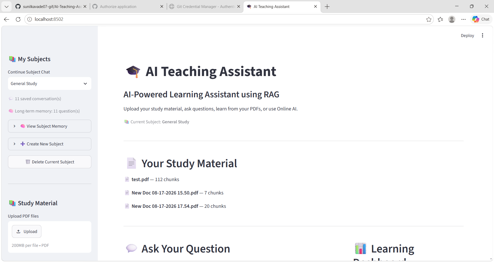
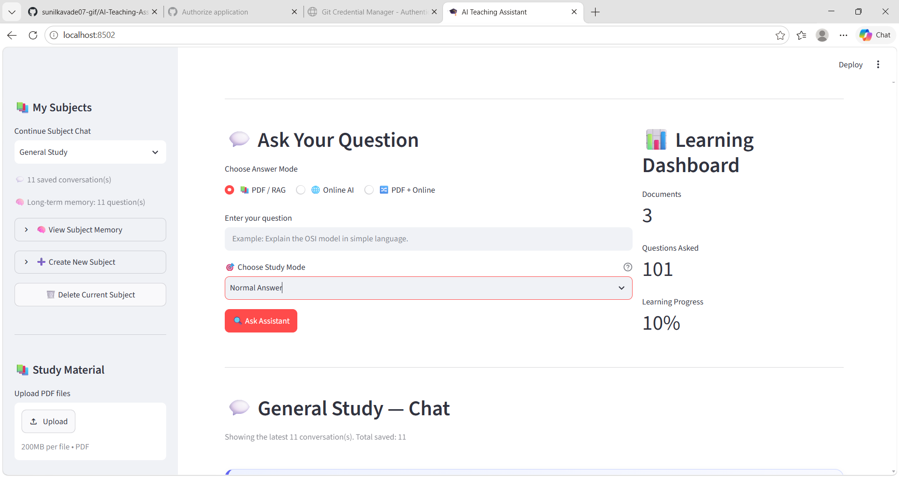
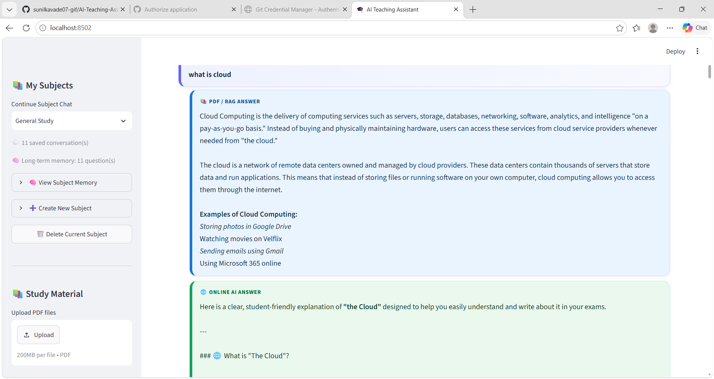
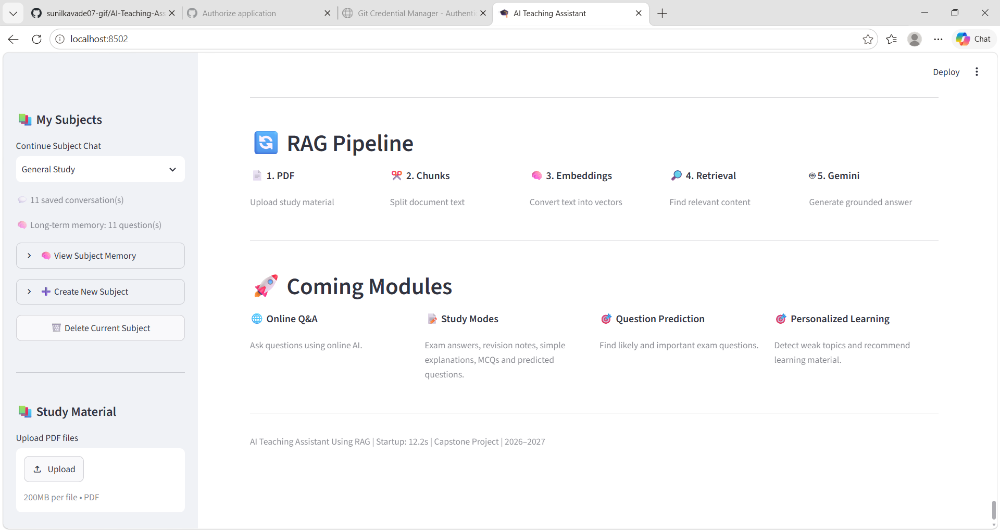

🚀 **Live Demo:** https://ai-teaching-assistant-tbts6w5pzuuewgqhxdkvw.streamlit.app/
# 🤖 AI Teaching Assistant

> An AI-powered teaching assistant that helps students understand educational content using Retrieval-Augmented Generation (RAG), semantic retrieval, document processing, and Google Gemini.

[](https://www.python.org/)
[](https://streamlit.io/)
[](https://ai.google.dev/)
[](https://en.wikipedia.org/wiki/Retrieval-augmented_generation)
[]()

---

## 📌 Project Overview

**AI Teaching Assistant** is an educational AI application designed to help students interact with their study material and receive context-aware answers.

The application combines document processing, text chunking, semantic retrieval, and AI-based response generation to create an interactive learning experience.

Students can upload study material, select a subject, ask questions, and choose different learning modes according to their requirements.

---

## 🎯 Project Goals

- Make learning more interactive and accessible.
- Allow students to ask questions about their study material.
- Provide context-aware answers using RAG.
- Support PDF-based educational content.
- Provide different explanation and revision modes.
- Help students with exam-oriented preparation.
- Maintain subject-based learning context.

---

## ✨ Key Features

### 📄 PDF & Document Processing

- Upload educational PDF documents.
- Extract text from study material.
- Process documents into smaller text chunks.
- Prepare educational content for retrieval.

### 🧠 Retrieval-Augmented Generation

The project uses a RAG-based workflow to retrieve relevant information before generating an AI response.

```text
Educational Material
        ↓
Document Processing
        ↓
Text Chunking
        ↓
Knowledge Storage
        ↓
User Question
        ↓
Relevant Information Retrieval
        ↓
AI Response Generation
        ↓
Student Answer

---

### 🤖 AI-Powered Question Answering

Students can ask questions about their educational content and receive AI-generated responses based on the selected answer mode and available study material.

### 📚 Multiple Study Modes

The application provides different learning modes:

- Normal Answer
- Simple Explanation
- Exam Answer
- Quick Revision
- MCQ Practice
- Predicted Questions

### 🔎 Answer Modes

The application supports:

- PDF / RAG
- Online AI
- PDF + Online

### 🧑‍🎓 Subject-Based Learning

Students can select different subjects and maintain subject-based learning context.

### 📊 Learning Dashboard

The application provides learning-related information such as:

- Documents
- Questions Asked
- Learning Progress

---

# 🖥️ Application Screenshots

## Dashboard



## Question Interface



## AI Answer



## RAG Pipeline



---

# 🏗️ Project Architecture

The project is organized into application and RAG components.

```text
AI-Teaching-Assistant/
│
├── app/
│   └── main.py
│
├── rag/
│   ├── app.py
│   ├── chunker.py
│   ├── generator.py
│   ├── online.py
│   ├── pdf_processor.py
│   ├── pdf_processor_backup.py
│   ├── question_predictor.py
│   ├── retriever.py
│   ├── storage.py
│   ├── subjects.json
│   └── subject_memory.json
│
├── tests/
│   ├── test_chunker.py
│   ├── test_document_ai.py
│   ├── test_gemini_vertex.py
│   ├── test_online.py
│   ├── test_pdf.py
│   └── test_rag.py
│
├── assets/
│   └── screenshots/
│       ├── 01-dashboard.png
│       ├── 02-question-interface.png
│       ├── 03-ai-answer.png
│       └── 04-rag-pipeline.png
│
├── .gitignore
├── README.md
└── requirements.txt